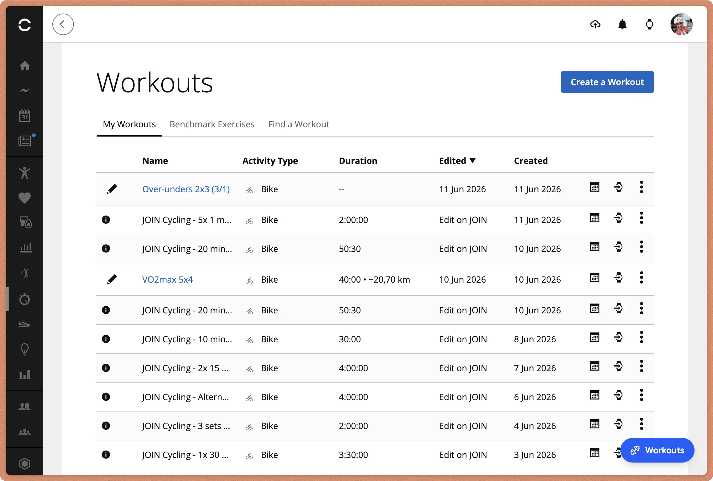
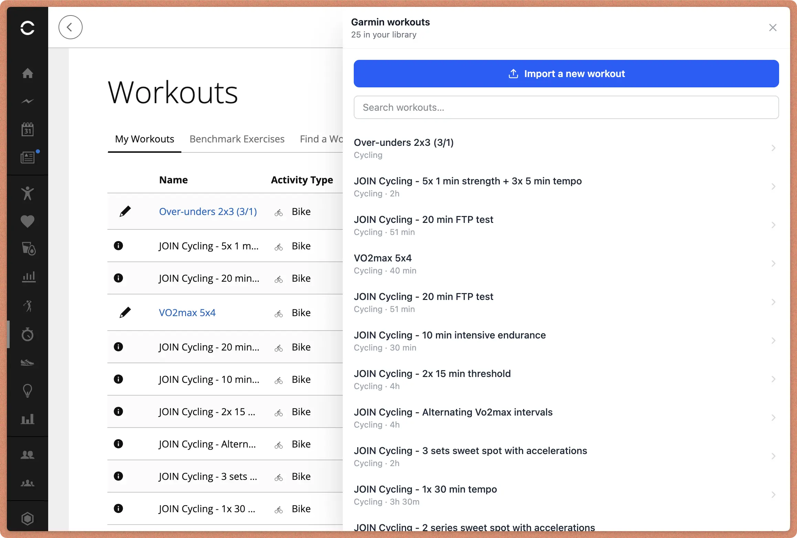
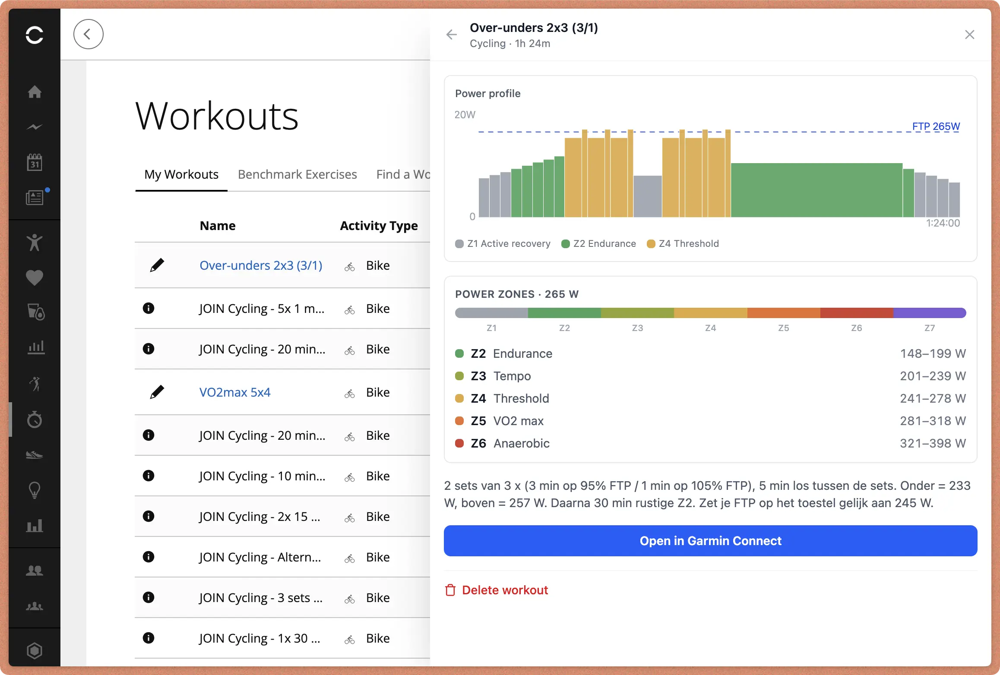

# Garmin Workout Importer

A Chrome extension that manages your **Garmin Connect** workouts: build new ones
from scratch, or import them from `.json` or `.zwo` (Zwift) files. ZWO files are
converted to Garmin's structured-workout JSON format in the browser before
upload.

The UI is an **in-page drawer**. A floating **Workouts** button sits at the
bottom-right of every Garmin Connect page; clicking it slides out a drawer that:

- **Lists your existing workouts** — search them, and click one to see its power
  profile, details, open it on Garmin, delete, clone, or edit it.
- **Creates a workout** — start from a template (endurance, sweet spot,
  threshold, VO₂ max, over–unders, recovery) or from nothing, add and reorder
  steps, set power in watts or `% FTP`, and send it to Garmin. No file needed.
- **Imports a new workout** — the import flow takes a file (picker or
  drag-and-drop) plus your FTP and shows power zones and an FTP-adaptive
  preview. You can edit, add, reorder, or delete steps before importing.
- **Exports coach data** — downloads a `garmin-coach-export-YYYY-MM-DD.json`
  snapshot (athlete profile, readiness, training load, trend data, and your last
  6 weeks of rides). Drop it into any AI (ChatGPT, Claude, Gemini, …) to get
  personalised training analysis, recovery advice, or AI-generated workout plans
  tailored to your current fitness and load. For a purpose-built Claude
  experience, use the
  [Cycling Plan Coach skill](https://github.com/estruyf/skill-cycling-plan-coach).

Because it runs on `connect.garmin.com`, everything uses your real, logged-in
session (same-origin) — so there is no separate login and no Cloudflare challenge.

## Screenshots

### Workouts button on Garmin Connect



### Workouts drawer overview



### Workout details view



## How to use

1. Sign in to [connect.garmin.com](https://connect.garmin.com).
2. Click the floating **Workouts** button (bottom-right) — or the extension's
   toolbar icon — to open the drawer. It lists your workouts.
3. Click a workout to see its power-profile graph and details, or use
   **Create a workout** / **Import a file** at the top.
4. To create: enter a name and your **FTP**, optionally pick a template, then
   add, edit, reorder, or delete steps. Step power can be typed in watts or as
   `% FTP`, and the preview chart updates as you go. Click **Create in Garmin**
   when it looks right. Changing your FTP re-scales an untouched template.
5. To import: pick a `.json` or `.zwo` file (or drag-and-drop it), enter your
   **FTP** in watts (for ZWO the `% FTP` targets convert to watts and the
   preview updates live), edit steps if needed, set the name, and click
   **Import to Garmin**.
6. To export coach data: click the **Export** button in the workout list header.
   The downloaded JSON includes your athlete profile, today's readiness snapshot,
   training load metrics, HRV/HR trends, and the last 6 weeks of cycling
   activities. You can then paste or upload this file into an AI assistant
   (ChatGPT, Claude, Gemini, …) to get personalised training analysis, recovery
   advice, or fully structured workout plans based on your current fitness and
   training load. For the best Claude experience, install the
   [Cycling Plan Coach skill](https://github.com/estruyf/skill-cycling-plan-coach)
   — it understands the export format and can generate ready-to-import workouts.

## How it works

- A content script (`src/content/`) injects the drawer into the page inside a
  Shadow DOM (so Garmin's styles and ours stay isolated). It reads the file,
  converts ZWO → Garmin JSON, renders the power-profile preview (`WorkoutChart`)
  and power zones (`PowerZones`) that recompute as you change FTP.
- On create/import it reads the page's `<meta name="csrf-token">` and POSTs to
  `connect.garmin.com/gc-api/workout-service/workout` — the same call the Garmin
  web app makes itself.
- JSON files are normalized (server-managed fields stripped, step IDs cleared)
  the way Garmin expects for a freshly created workout.
- Conversion/preview logic lives in `src/lib/`: `zwo.ts` (ZWO → Garmin),
  `workout-json.ts` (JSON import), `workout-builder.ts` (new workouts and the
  template catalogue), `workout-steps.ts` (step-tree edits), `profile.ts`
  (power profile), `garmin-api.ts` (the gc-api client).

### ZWO conversion notes

- **FTP** is prefilled: the last value you used is remembered (`chrome.storage`),
  and on open the extension also reads your latest cycling FTP from Garmin. A
  value you've typed always wins.
- **Ramps** — Zwift `Warmup`, `Cooldown`, and `Ramp` segments ramp power
  continuously. Garmin has no intra-step power ramp, so each ramp is split into
  several flat sub-steps (~one per 2 min, 3–8 steps) that step-approximate the
  slope. Short ramps stay a single step.
- **Cadence** — ZWO `Cadence` / `CadenceResting` become a Garmin secondary
  cadence target on the step.
- **Notes** — ZWO `<textevent>` messages become the step's description.

## Commands

### dev

```bash
npm run dev      # launches Chrome with the extension loaded + HMR
```

Sign in to Garmin Connect, then use the **Import workout** button.

### build

```bash
npm run build:chrome     # production build into dist/chrome
```

Load the unpacked build (`dist/chrome`) via `chrome://extensions` → **Load
unpacked** to run it in your day-to-day Chrome profile.

## Learn more

[Extension.js docs](https://extension.js.org).

<br />

<p align="center">
  <a href="https://visitorbadge.io/status?path=https%3A%2F%2Fgithub.com%2Festruyf%2Fgarmin-workout-browser-extension"></a>
</p>

